* **docker.cpu.usage.user.percent**

| Normal Utilization | High Utilization |
|---|---|
| 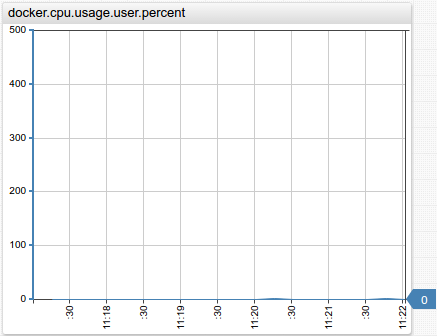 | 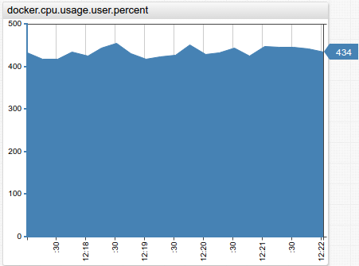 |

* **docker.cpu.usage.total.percent**

| Normal Utilization | High Utilization |
|---|---|
| 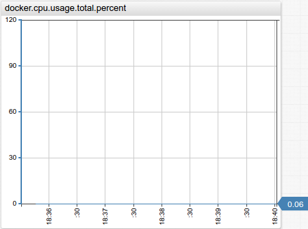 | 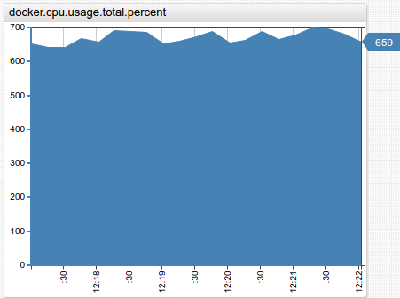 |

* **docker.cpu.usage.kernel.percent**

| Normal Utilization | High Utilization |
|---|---|
|  | 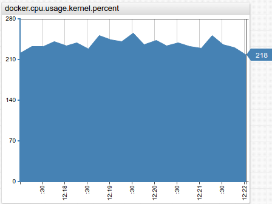 |

* **docker.cpu.usage.kernel.percent**

| Normal Utilization | High Utilization |
|---|---|
|  |  |

* **docker.cpu.throttlingdata.periods**

| Normal Utilization | High Utilization |
|---|---|
| 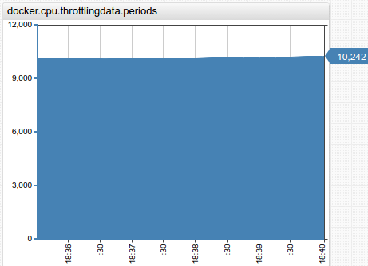 | 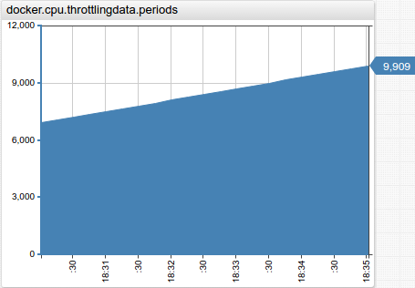 |

* **docker.cpu.throttlingdata.throttledperiods**

| Normal Utilization | High Utilization |
|---|---|
| 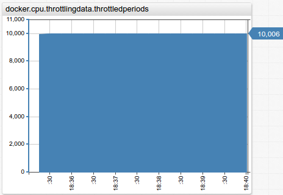 | 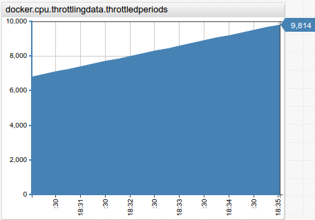 |

* **docker.cpu.avg.usage.total.percent**

| Normal Utilization | High Utilization |
|---|---|
| 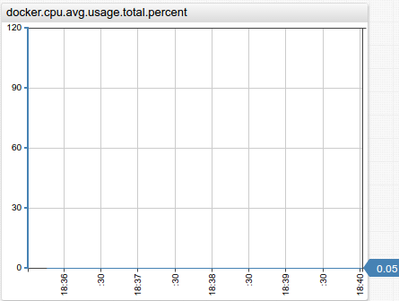 | 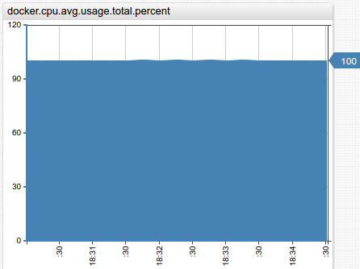 |

* **docker.cpu.avg.usage.allocated.percent**

| Normal Utilization | High Utilization |
|---|---|
| 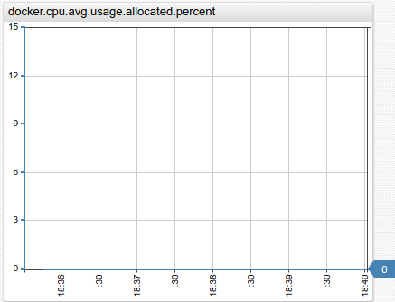 | 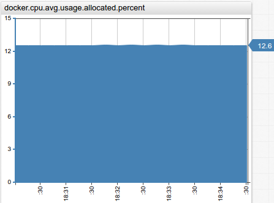 |

* **docker.cpu.avg.usage.host.percent**

| Normal Utilization | High Utilization |
|---|---|
| 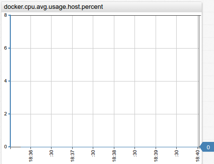 | 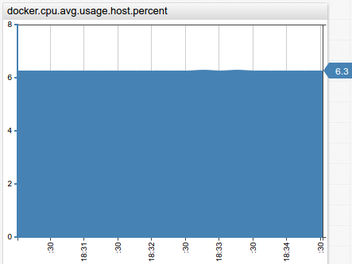 |

* **docker.cpu.avg.usage.kernel.percent**

| Normal Utilization | High Utilization |
|---|---|
| 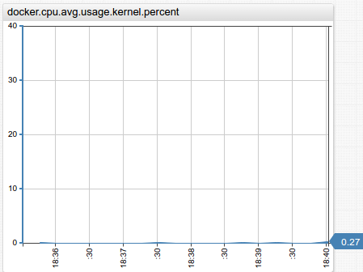 | 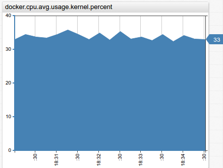 |

* **docker.cpu.avg.usage.user.percent**

| Normal Utilization | High Utilization |
|---|---|
| 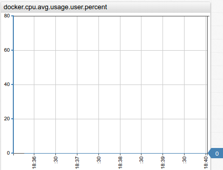 | 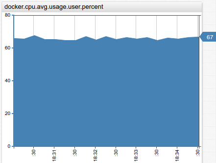 |

* **docker.memory.activeanon**

| Normal Utilization | High Utilization |
|---|---|
| 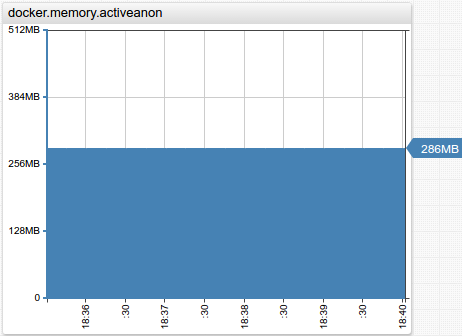 | 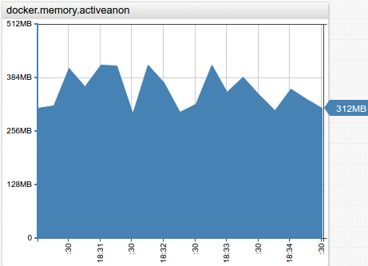 |
