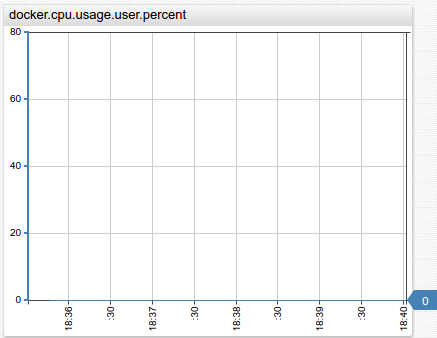
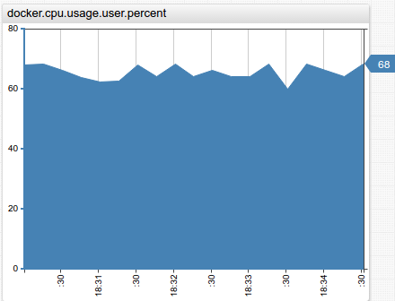
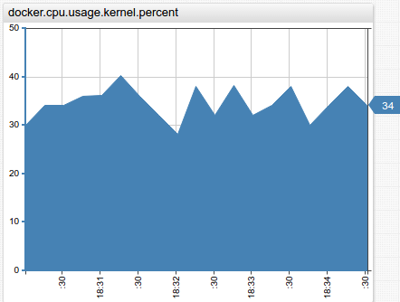
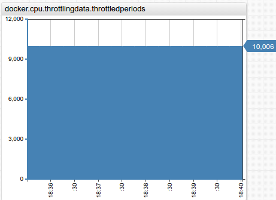

CPU info:
--
Architecture:          x86_64  
CPU op-mode(s):        32-bit, 64-bit  
Byte Order:            Little Endian  
CPU(s):                8  
On-line CPU(s) list:   0-7  
Thread(s) per core:    2  
Core(s) per socket:    4  
Socket(s):             1  
NUMA node(s):          1  
Vendor ID:             GenuineIntel  
CPU family:            6  
Model:                 60  
Model name:            Intel(R) Xeon(R) CPU E3-1271 v3 @ 3.60GHz  
Stepping:              3  
CPU MHz:               3875.097  
CPU max MHz:           4000.0000  
CPU min MHz:           800.0000  
BogoMIPS:              7183.48  
Virtualization:        VT-x  
L1d cache:             32K  
L1i cache:             32K  
L2 cache:              256K  
L3 cache:              8192K  
NUMA node0 CPU(s):     0-7  

Docker `run` command's parameters:
--
`--cpu-period=10000 --cpu-quota=5000`

CPU docker metrics:
--

* **docker.cpu.usage.user.percent**

| Normal Utilization | High Utilization |
|---|---|
|  |  |

* **docker.cpu.usage.total.percent**

| Normal Utilization | High Utilization |
|---|---|
|  |  |

* **docker.cpu.usage.kernel.percent**

| Normal Utilization | High Utilization |
|---|---|
|  |  |

* **docker.cpu.usage.kernel.percent**

| Normal Utilization | High Utilization |
|---|---|
|  |  |

* **docker.cpu.throttlingdata.periods**

| Normal Utilization | High Utilization |
|---|---|
|  |  |

* **docker.cpu.throttlingdata.throttledperiods**

| Normal Utilization | High Utilization |
|---|---|
|  |  |

* **docker.cpu.avg.usage.total.percent**

| Normal Utilization | High Utilization |
|---|---|
|  |  |

* **docker.cpu.avg.usage.allocated.percent**

| Normal Utilization | High Utilization |
|---|---|
|  |  |

* **docker.cpu.avg.usage.host.percent**

| Normal Utilization | High Utilization |
|---|---|
|  |  |

* **docker.cpu.avg.usage.kernel.percent**

| Normal Utilization | High Utilization |
|---|---|
|  |  |

* **docker.cpu.avg.usage.user.percent**

| Normal Utilization | High Utilization |
|---|---|
|  |  |
